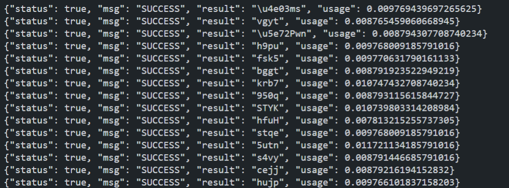

# captchaocr
基于ddddocr+flask实现的通用验证码识别接口

### 效果测试
```
在并发情况下，识别速度可以在0.01s或以下
```



### 安装
```
python >= 3.8
```
```
conda install opencv-python flask
pip install ddddocr -i https://pypi.tuna.tsinghua.edu.cn/simple/
```

### 配置文件
配置文件位于service.conf
```
[service]
# http服务监听的地址
listen = 0.0.0.0
# 监听的端口
port = 5000
# 创建10个ddddocr实例，应用场景并发比较高就需要改高
worker_threads = 10
```

### 启动
```
python main.py
```

### 联系我
```
wlkjyy@vip.qq.com
```
